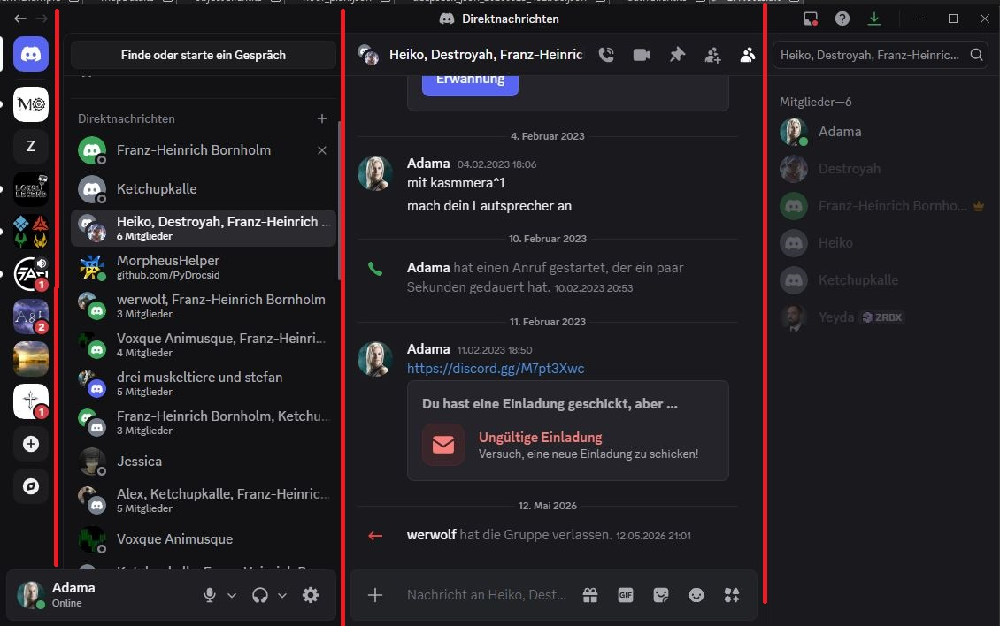
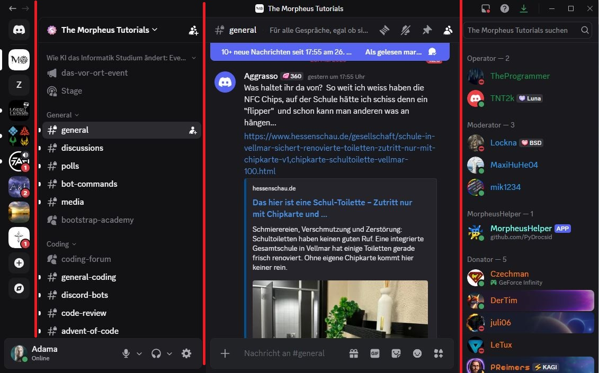

# MessengerClient — Implementierungsplan

> Discord-ähnliches UI-Mockup auf späterer Basis der Virtual-Office-Microservice-Architektur.

> Wer später nur mit dem MessangerClient angemeldet ist, erscheint für die im Virtuellen Büro an seinem Schreibtisch und ist ansprechbar (ProxyCall wird für den in dem MessangerClient ein klassischer Call)

---

## Inhalt

1. [Kontext & Ziel](#kontext--ziel)
2. [Spaces & Rollen-Konzept](#spaces--rollen-konzept)
3. [Stack](#stack)
4. [Projektstruktur](#projektstruktur)
5. [Datenmodell](#datenmodell)
6. [Mock-Daten](#mock-daten)
7. [UI-Layout](#ui-layout)
8. [Farbpalette](#farbpalette)
9. [Umsetzungsschritte](#umsetzungsschritte)
10. [Auth-Architektur & Sicherheit](#auth-architektur--sicherheit)
11. [Ende-zu-Ende-Verschlüsselung](#ende-zu-ende-verschlüsselung-feature--noch-zu-diskutieren)
12. [Verifikation](#verifikation)

---

## Kontext & Ziel

Das Ziel ist ein reines **UI-Mockup** eines Messenger-Clients mit Discord-ähnlicher Optik — zunächst als Präsentations-Prototype ohne echte API-Aufrufe. Alle Daten sind statisch (hardcoded Mock-Daten).

Das Datenmodell spiegelt die echte Microservice-Architektur (AuthService, MessageService, ProfileService) wider, damit ein späterer Umbau zum vollständigen Client mit minimalem Aufwand möglich ist.

**Business-Kontext:** Der MessengerClient ist ein **internes Unternehmenswerkzeug** — nicht öffentlich zugänglich. Nutzerkonten werden ausschließlich durch Administratoren oder einen kontrollierten Registrierungsprozess angelegt. Externe Gäste (Kunden, Messekontakte) können eingeschränkte Konten mit der Rolle `Customer` erhalten.

Das größte Sicherheitsrisiko ist der **Mitarbeiter selbst** (kompromittiertes Gerät, Insider-Bedrohung). Die Architektur schützt primär gegen externe Angreifer und verhindert, dass selbst der Serverbetreiber private Nachrichten lesen kann.

---

## Spaces & Rollen-Konzept

### Spaces

Spaces sind abgeschlossene Bereiche — vergleichbar mit Discord-Servern, aber auf den Unternehmenskontext zugeschnitten.

| Space | Zugang | Zweck | Beispiel-Channels |
|-------|--------|-------|-------------------|
| **Büro München** | Nur Mitarbeiter | Interne Kommunikation nach Abteilungen | #allgemein, #buchhaltung, #it, #hr |
| **Kundenkontakt** | Vertrieb + Customer-Nutzer | Externe Kommunikation, Akquise, Events | #virtueller-messestand, #webinare, #meetings, #kundengewinnung |

Weitere Spaces (z. B. Büro Berlin, Freischule) folgen demselben Muster.

### Rollen

| Rolle | Beschreibung | Kann |
|-------|-------------|------|
| `Admin` | IT / Unternehmensadmin | Spaces und Channels erstellen, alle Nutzer verwalten, Rollen vergeben |
| `Employee` | Mitarbeiter | Eigenen Spaces beitreten, DMs senden, Channel-Admin-Rechte erhalten |
| `Channel-Admin` | Abteilungsleiter | Mitglieder zum Channel hinzufügen/entfernen, Key-Rotation auslösen |
| `Channel-Assistent` | Assistent des Abteilungsleiters | Mitglieder hinzufügen, aber keine Key-Rotation |
| `Customer` | Externer Gast / Kunde | Nur zugewiesene Channels im Kundenkontakt-Space sehen und schreiben |

> `Channel-Admin` und `Channel-Assistent` sind keine globalen Rollen, sondern Channel-spezifische Berechtigungen — ein Mitarbeiter kann in Kanal A Admin und in Kanal B normales Mitglied sein.

### Channel-Typen

| Typ | Beispiel | E2E-Verschlüsselung | Beitritt |
|-----|---------|--------------------|----|
| Privater Abteilungs-Channel | #buchhaltung | ✅ AES-256 Gruppenkey | Nur per Einladung durch Channel-Admin |
| Space-interner Channel | #allgemein | ✅ AES-256 Gruppenkey | Alle Space-Mitglieder automatisch |
| Kunden-Channel | #meeting-musterfirma | ✅ AES-256 Gruppenkey | Einladung (Employee + Customer) |
| Frei beitretbarer Channel | #virtueller-messestand | ❌ Nur HTTPS | Jeder mit Link / alle Space-Mitglieder |
| Öffentliche Ankündigung | #news | ❌ Nur HTTPS | Nur lesen, kein Schreiben |

> **Designentscheidung:** Frei beitretbare und öffentliche Channels werden bewusst nicht E2E-verschlüsselt. Da die Mitgliedschaft unkontrolliert ist, wäre ein Gruppenkey sinnlos — jeder könnte ihn erhalten. HTTPS schützt den Transport; der Serverbetreiber kann diese Nachrichten einsehen. Das ist für Webinare, Messestände und FAQ-Kanäle akzeptabel.

### Channel-Erstellung — UI (Toggle-Logik)

Beim Anlegen eines neuen Channels gibt es zwei Toggle-Einstellungen, die sich gegenseitig ausschließen:

```
┌─────────────────────────────────────────────────────┐
│  Neuen Channel erstellen                            │
│                                                     │
│  Name: [___________________________]                │
│                                                     │
│  [✅] Ende-zu-Ende-Verschlüsselung    ← Standard: AN │
│       Nachrichten sind nur für Mitglieder lesbar.   │
│                                                     │
│  [☐ ] Frei beitretbar               ← Standard: AUS │
│       Jeder mit dem Link kann beitreten.            │
│       (Deaktiviert automatisch die Verschlüsselung) │
│                                                     │
│              [Abbrechen]  [Channel erstellen]       │
└─────────────────────────────────────────────────────┘
```

**Regel:** Wird "Frei beitretbar" aktiviert, wird die Verschlüsselung automatisch deaktiviert und ausgegraut — und umgekehrt. Beide Toggles können nicht gleichzeitig aktiv sein.

---

## Stack

| Technologie | Version | Zweck |
|-------------|---------|-------|
| React | 18 | UI-Framework |
| TypeScript | 5 | Typsicherheit |
| Vite | 5 | Build-Tool & Dev-Server |
| TailwindCSS | 3 | Styling (keine externe Komponentenbibliothek) |
| react-router-dom | 6 | Client-seitiges Routing |
| livekit-client | — | Vorbereitung für spätere Audio/Video-Integration |

---

## Projektstruktur

```
MessangerClient/
├── index.html
├── vite.config.ts
├── tailwind.config.js
├── tsconfig.json
├── package.json
└── src/
    ├── main.tsx
    ├── App.tsx
    ├── types/
    │   └── index.ts                # User, Message, Conversation, Status
    ├── data/
    │   └── mockData.ts             # Statische Beispieldaten
    ├── store/
    │   └── AppContext.tsx          # React Context: aktiver User, aktive Conversation
    ├── services/                   # Vorbereitung für echte API-Anbindung
    │   ├── authService.ts          # AuthService-Aufrufe (Login, Refresh, Logout)
    │   ├── profileService.ts       # Name und AvatarURL
    │   ├── messageService.ts       # MessageService-Aufrufe
    │   └── meetingService.ts       # LiveKit / RecordingService
    ├── components/
    │   ├── auth/
    │   │   └── LoginPage.tsx       # Login-Formular (visuell, kein echtes Submit)
    │   ├── layout/
    │   │   ├── AppSidebar.tsx      # Schmale linke Leiste (72 px) mit App-Icons
    │   │   ├── ChannelSidebar.tsx  # DM-/Gesprächsliste (~240 px)
    │   │   ├── TopBar.tsx          # Header: Gesprächsname + Icons
    │   │   └── UserListPanel.tsx   # Rechte Sidebar: Online-Nutzer
    │   ├── chat/
    │   │   ├── ChatArea.tsx        # Scrollbarer Nachrichtenverlauf
    │   │   ├── MessageBubble.tsx   # Einzelne Nachricht (Avatar, Name, Zeit, Text)
    │   │   └── MessageInput.tsx    # Eingabezeile (Enter simuliert Senden)
    │   └── common/
    │       ├── Avatar.tsx          # Rundes Profilbild mit Status-Dot
    │       └── StatusBadge.tsx     # Online / Away / DND / Offline
    └── views/
        ├── AuthView.tsx            # Wrapper für LoginView
        └── ChatView.tsx            # Haupt-Layout (alle Layout-Komponenten)
```

---

## Datenmodell

Die Typen orientieren sich direkt an den API-Feldern der echten Services.

```typescript
// src/types/index.ts

type UserStatus = 'online' | 'away' | 'dnd' | 'offline';

interface User {
  id: string;
  displayName: string;
  avatarUrl?: string;
  status: UserStatus;
  email: string;
}

interface Message {
  id: string;
  senderId: string;
  recipientId: string;
  body: string;
  createdAt: string;        // ISO-String — spiegelt MessageService.createdAt
  readAt: string | null;    // null = ungelesen
}

interface Conversation {
  id: string;
  participants: User[];
  messages: Message[];
  unreadCount: number;
}
```

---

## Mock-Daten

**Datei:** `src/data/mockData.ts`

- **6–8 fiktive Nutzer** mit Namen, Status und Placeholder-Avataren
  (`https://api.dicebear.com/7.x/avataaars/svg?seed={name}`)
- **3–4 Konversationen** mit je 10–20 Nachrichten
- **1 eingeloggter "Ich"-Nutzer**, fixiert im AppContext

---


## UI-Layout

Die Oberfläche ist in vier Spalten gegliedert — Spalte 4 ist optional und kontextsensitiv.

```
┌──────┬──────────────────┬──────────────────────────────────┬─────────────┐
│      │                  │  TopBar  (Gesprächsname + Icons)               │
│      │                  ├──────────────────────────────────┼─────────────┤
│ App  │ Channel          │                                  │             │
│ Side │ Sidebar          │   ChatArea                       │  UserList   │
│ bar  │                  │   (Nachrichten-Feed)             │  Panel      │
│ 72px │ 240px            │                                  │  200px      │
│      │ ├ DM-Nutzer      ├──────────────────────────────────┤ (optional)  │
│      │ ├ Gruppen        │  MessageInput                    │             │
│      │ └ Space-Channels │                                  │             │
└──────┴──────────────────┴──────────────────────────────────┴─────────────┘
```


*Discord DM-Ansicht: AppSidebar (72 px, links) · DM- und Gruppenliste mit Mitgliederanzahl (240 px) · Nachrichtenverlauf mit Datums-Trennlinien · Mitgliederliste (200 px, rechts)*


*Discord Server-Ansicht: AppSidebar mit Space-Icons · Kanal-Sidebar mit Kategorien (Text, Stage, Forum) · Chat-Bereich mit Link-Preview · Mitglieder nach Rollen gruppiert (Operator, Moderator, Donator)*


### Spalte 1 — AppSidebar (72 px)

Schmale Icon-Leiste; Tooltip beim Hover zeigt den Space-Namen.

| Icon | Ziel |
|------|------|
| Freunde | Kontaktliste |
| Chats | Direkt-Nachrichten |
| VirtualOffice | Space VirtualOffice |
| Verkaufs-Office | Space Verkaufs-Office |
| Freischule | Space Freischule |

### Spalte 2 — ChannelSidebar (240 px)

- Direkte Unterhaltungen mit einzelnen Nutzern
- Gruppenunterhaltungen
- Bei Spaces: Channel-Liste mit unterschiedlichen Kanal-Typen (Text, Audio, Video, Forum, OnBoarding, FAQ)

### Spalte 3 — Hauptbereich

- Nachrichten-Feed (ChatArea)
- Anruf-Ansicht mit Transkript

### Spalte 4 — UserListPanel (200 px, optional)

Nutzerliste der aktiven Gruppe oder App — ein-/ausblendbar.

---

## Farbpalette

Discord Dark Theme als Grundlage; alle Werte werden als Tailwind Custom Tokens definiert.

| Token | Hex | Verwendung |
|-------|-----|------------|
| `bg-app-sidebar` | `#202225` | AppSidebar-Hintergrund |
| `bg-channel-sidebar` | `#2F3136` | ChannelSidebar-Hintergrund |
| `bg-chat` | `#36393F` | Chat-Bereich |
| `bg-input` | `#40444B` | Eingabefeld |
| `text-primary` | `#DCDDDE` | Haupttext |
| `text-muted` | `#72767D` | Zeitstempel, Beschriftungen |
| `accent` | `#5865F2` | Buttons, Markierungen (Discord Blurple) |
| `online` | `#3BA55C` | Online-Status |
| `away` | `#FAA61A` | Abwesend |
| `dnd` | `#ED4245` | Nicht stören |
| `offline` | `#747F8D` | Nicht erreichbar |

---

## Umsetzungsschritte

### Phase 1 — Projekt aufsetzen

1. `npm create vite@latest MessangerClient -- --template react-ts`
2. TailwindCSS installieren & Custom-Farben in `tailwind.config.js` eintragen
3. Basis-Routing: `react-router-dom` — Route `/login` und `/` (ChatPage)

### Phase 2 — Typen, Mock-Daten & Context

4. `src/types/index.ts` — alle Interfaces definieren
5. `src/data/mockData.ts` — Nutzer, Konversationen, Nachrichten befüllen
6. `src/store/AppContext.tsx` — aktiver Nutzer + aktive Konversation als State

### Phase 3 — Layout-Komponenten

7. `AppSidebar.tsx` — Icon-Leiste links (App-Logo + Trennlinie)
8. `ChannelSidebar.tsx` — DM-Liste: Avatar, Name, letzter Nachrichtenauszug, Unread-Badge
9. `TopBar.tsx` — Name + Status der aktiven Konversation + Dummy-Aktions-Icons
10. `UserListPanel.tsx` — rechte Sidebar mit Nutzer-Gruppen (Online / Offline)

### Phase 4 — Chat

11. `MessageBubble.tsx` — Nachricht mit Avatar, Absender-Name, Zeitstempel, Text, fremde Bubble links + eigene Bubble rechts anordnen
12. `ChatArea.tsx` — Verlauf rendern, auto-scroll ans Ende, Datum-Trennlinien
13. `MessageInput.tsx` — Eingabefeld + Senden-Button; Enter fügt lokale Mock-Nachricht hinzu

### Phase 5 — Auth-Seite & Common

14. `LoginPage.tsx` — Discord-ähnliches Login-Formular (dunkel, zentriert); drei States: E-Mail-Eingabe → Passwort (Login) oder Passwort+Repasswort (Registrierung); zusätzlich klassisches Registrierungs-Modal über Link erreichbar; Submit navigiert zu `/`
15. `Avatar.tsx` / `StatusBadge.tsx` — wiederverwendbare Hilfskomponenten

### Phase 6 — Feinschliff

16. Responsive Verhalten: UserListPanel auf kleinen Screens ausblenden
17. Hover-Effekte, aktive Konversation hervorheben, Übergänge
18. Favicon + Seitentitel "MessengerClient"
19. Chats als Favoriten anpinnen

---

## Auth-Architektur & Sicherheit

Dieser Abschnitt beschreibt, wie die Authentifizierung im echten Client — auf Basis des AuthService — sicher implementiert werden soll.

### Überblick des Token-Systems

Der AuthService verwendet ein **Dual-Token-Verfahren**:

| Token | Format | Speicherort | `HttpOnly` | Lebensdauer |
|-------|--------|-------------|------------|-------------|
| Access Token | JWT (RS256) | In-Memory (React Context) | — | Kurz (15 min) |
| Refresh Token | Opaque | Cookie, Pfad `/user/refresh` | ✅ | 14 Tage |
| CSRF Token | Opaque | Cookie, Pfad `/user/refresh` | ❌ | 14 Tage |

### Login-Flow

```
Client                        AuthService
  │                               │
  │  POST /user/login             │
  │  { email, password,           │
  │    device_fingerprint,        │
  │    device_name }              │
  │ ─────────────────────────── > │
  │                               │  Validiert Credentials (bcrypt via passlib.CryptContext AuthService/auth.py:28)
  │                               │  In der Datenbank wird get_password_hash(password) gespeichert. Der JWT wird nicht gespeichert. Der Refresh-Token wird mit SHA-256 gehasht in der Datenbank gespeichert (schneller und es gibt keine leicht erratbaren Token)
  │  200 { access_token, ... }    │  Erstellt Access-JWT & Refresh-Token
  │  Set-Cookie: refresh_token    │  hash(refresh_token) + hash(csrf_token) → DB
  │  Set-Cookie: csrf_token       │
  │ < ─────────────────────────── │
  │                               │
  │  Access Token → In-Memory     │
  │  refresh_token → HttpOnly-Cookie (Browser verwaltet)
  │  csrf_token    → lesbares Cookie → JS liest & merkt sich Wert
```

Der `access_token` wird **niemals** in `localStorage` oder `sessionStorage` abgelegt — nur im React-Context (Arbeitsspeicher). 
Damit ist er vor XSS-Angriffen geschützt, da kein JavaScript außerhalb der App-Laufzeit darauf zugreifen kann.

### JWT-Verifikation (RS256)

Jeder Microservice verifiziert JWTs **eigenständig** ohne Rückfrage beim AuthService:

```
Startup jedes Microservice:
  GET /jwt/public-key  →  RSA-Public-Key cachen

Pro Request:
  JWT-Signatur lokal mit Public Key prüfen
  → kein Single Point of Failure
  → kein Netzwerk-Overhead pro Request
```

Der JWT-Payload enthält `user_id`, `email`, eine Liste von `roles` und ein Dict von `permissions`. Der Client liest diese Felder aus dem dekodiertem Token, um UI-Elemente rollenabhängig zu rendern (Admin-Bereiche etc.).

> **Achtung:** Der Client darf die JWT-Signatur nicht als Sicherheitsbeweis behandeln. Die Verifikation findet serverseitig statt. Client-seitiges Dekodieren dient ausschließlich der UI-Steuerung.
Falls der JWT gefälscht ist und das Adminrecht gegeben wurde, dann wird der Adminbereicht des Clients zwar angezeigt, aber die Requests werden durch die falsche Signatur von den Services abgelehnt.

### Token-Refresh

Da Access Tokens kurzlebig sind, muss der Client sie regelmäßig erneuern:
Die Auto-Refresh Strategie ist, dass die App alle 10 Minuten den Refresh durchführt. 
Requests die noch den alten JWT nutzen funktionieren noch, da 5 Minuten bis zum Expire verbleiben und nicht gespeicherte JWT´s nicht gelöscht oder invalidiert werden können.

```
Client                          AuthService
  │                                 │
  │  (Access Token läuft ab)        │
  │                                 │
  │  POST /user/refresh             │
  │  Cookie: refresh_token          │
  │  Cookie: csrf_token             │
  │  Header: X-CSRF-Token: <wert>   │  ← JS liest csrf_token-Cookie, setzt Header
  │ ─────────────────────────────>  │
  │                                 │  hash(refresh_token) in DB suchen
  │                                 │  hash(csrf_token) mit DB-Eintrag vergleichen
  │                                 │  beide Hashes müssen übereinstimmen
  │                                 │  Rotation: neue Token generieren, alte löschen
  │  200 { access_token }           │
  │  Set-Cookie: refresh_token (neu)│
  │  Set-Cookie: csrf_token (neu)   │
  │ <─────────────────────────────  │
  │                                 │
  │  Neuer Access Token → In-Memory │
```

**Refresh-Token-Rotation** stellt sicher, dass ein gestohlenes Refresh-Token nur einmalig verwendbar ist. Bei einem zweiten Versuch mit demselben Token wird die gesamte Session invalidiert.

### CSRF-Schutz

Der AuthService setzt beim Login zwei Cookies mit identischer Laufzeit (14 Tage):

| Cookie | `HttpOnly` | `SameSite` | `path` | Zweck |
|--------|-----------|------------|--------|-------|
| `refresh_token` | ✅ | Strict | `/user/refresh` | Opaker Token — JS kann ihn nicht lesen |
| `csrf_token` | ❌ | Strict | `/user/refresh` | JS liest ihn und schickt ihn als Header |

**Speicherung im AuthService:**
- `hash(refresh_token)` und `hash(csrf_token)` werden als ein gemeinsamer DB-Eintrag gespeichert.
- Beide SHA-256-Hashes müssen bei `/user/refresh` übereinstimmen, sonst werden keine neuen Token ausgestellt.

**Client-Pflicht beim Refresh:**
```typescript
const csrfToken = getCookie('csrf_token'); // lesbares Cookie
await fetch('/user/refresh', {
  method: 'POST',
  credentials: 'include',               // sendet beide Cookies automatisch
  headers: { 'X-CSRF-Token': csrfToken }, // CSRF-Nachweis als Header
});
```

Ein Angreifer auf `evil.com` kann den `csrf_token`-Cookie von `freischule.info` nicht lesen (Same-Origin Policy) — und damit den `X-CSRF-Token`-Header nicht fälschen. Der `refresh_token` allein reicht also nicht aus.

`/user/logout-all` widerruft alle Refresh-Token-Einträge **inklusive ihrer CSRF-Hashes**.

### Logout

```typescript
// Lokalen State löschen
clearAccessToken();

// Refresh Token server-seitig invalidieren
POST /user/logout   // invalidiert das aktuelle Gerät
POST /user/logout-all  // invalidiert alle Sessions des Nutzers (JWT-Auth)
```

Nach dem Logout darf kein Access Token im Speicher verbleiben. Der `HttpOnly`-Cookie wird serverseitig durch Überschreiben mit einem abgelaufenen Cookie gecleart.

### Login- & Registrierungs-Flow

#### Email-first Flow (Standard)

Der AuthService stellt den Endpunkt `POST /user/check-email` bereit (aktuell in Umsetzung, Issues offen). Damit wird die E-Mail-Adresse vorab geprüft, bevor das Passwortfeld überhaupt erscheint.

```
Schritt 1 — Nur E-Mail:
┌─────────────────────────────────┐
│  Willkommen                     │
│                                 │
│  E-Mail: [___________________]  │
│                                 │
│  [        Weiter →          ]   │
│                                 │
│  Neu hier? → Jetzt registrieren │
└─────────────────────────────────┘

POST /user/check-email { email }
→ { status: "login" }    → Schritt 2a
→ { status: "register" } → Schritt 2b


Schritt 2a — Bekannte E-Mail (Login):
┌─────────────────────────────────┐
│  max@beispiel.de                │
│                                 │
│  Passwort: [________________]   │
│                                 │
│  [        Anmelden          ]   │
└─────────────────────────────────┘

POST /user/login { email, password, device_fingerprint, device_name }


Schritt 2b — Unbekannte E-Mail (Registrierung):
┌─────────────────────────────────┐
│  neu@beispiel.de                │
│                                 │
│  Passwort:           [________] │
│  Passwort wiederholen:[________]│
│                                 │
│  [       Registrieren       ]   │
└─────────────────────────────────┘

POST /user/register { email, password, repassword, device_fingerprint, device_name }
```

#### Klassischer Registrierungs-Flow (Fallback-Link)

Unter dem E-Mail-Formular (Schritt 1) gibt es einen Link **"Neu hier? Jetzt registrieren"**. Dieser öffnet ein Modal mit allen drei Feldern auf einmal — für Nutzer, die den klassischen Ablauf gewohnt sind:

```
┌─────────────────────────────────┐
│  Konto erstellen                │
│                                 │
│  E-Mail:              [_______] │
│  Passwort:            [_______] │
│  Passwort wiederholen:[_______] │
│                                 │
│  [       Registrieren       ]   │
│                                 │
│  Bereits registriert? Anmelden  │
└─────────────────────────────────┘

POST /user/register { email, password, repassword, device_fingerprint, device_name }
```

> **Hinweis:** Der Legacy-Flow über `POST /user/login` mit unbekannter E-Mail (Response `status: "register"`) bleibt als Fallback erhalten, solange `/user/check-email` noch nicht live ist.

### Sicherheits-Checkliste für die Implementierung

| Maßnahme | Begründung |
|----------|------------|
| Access Token nur In-Memory | Schutz vor XSS / localStorage-Diebstahl |
| Refresh Token als `HttpOnly`-Cookie | JavaScript kann den Token nicht lesen |
| CSRF Token als lesbares Cookie + Header | Double-Submit-Pattern schützt `/user/refresh` vor CSRF |
| CSRF-Hash in DB neben Refresh-Hash | Beide Tokens werden gemeinsam rotiert und validiert |
| RS256 statt HS256 | Asymmetrisch: kein gemeinsamer Secret zwischen Services |
| Refresh-Token-Rotation | Gestohlene Tokens werden sofort ungültig |
| Kurze Access-Token-Lebensdauer | Schadensminimierung bei Kompromittierung |
| `device_fingerprint` + `device_name` | Nachvollziehbarkeit aktiver Sessions |
| HTTPS-Only | Verhindert Token-Interception im Netzwerk |
| `logout-all`-Endpunkt | Widerruft alle Sessions inkl. CSRF-Hashes |
| Public-Key-Caching pro Service | Kein zentraler Auth-Bottleneck; Key-Rotation via `/admin/jwt/keys` |

---

## Ende-zu-Ende-Verschlüsselung *(Feature — noch zu diskutieren)*

> **Status:** Konzept, noch nicht beschlossen. Muss vor Implementierungsbeginn mit dem Team abgestimmt werden (Aufwand, UX, Multi-Device-Anforderungen).

### Ansatz: TweetNaCl.js + passwortgeschützter Key-Backup

#### Bibliothek
`tweetnacl` (~7 kb, auditiert) — `nacl.box` = X25519 Diffie-Hellman + XSalsa20-Poly1305.

#### Funktionsprinzip

```
Registrierung / erster Login:
  1. Client generiert Keypair: { publicKey, secretKey } = nacl.box.keyPair()
  2. publicKey → ProfileService (neues Feld im GlobalProfile)
  3. secretKey → mit PBKDF2 + Benutzerpasswort verschlüsseln
  4. Verschlüsselter Key-Blob → ObjectService (collection: "e2e-keys", ref: { userId })

Nachricht senden:
  1. publicKey des Empfängers aus ProfileService laden
  2. Ephemeres Keypair generieren (pro Nachricht) → Forward Secrecy
  3. nacl.box(message, nonce, recipientPublicKey, ephemeralSecretKey)
  4. Ciphertext + Nonce + ephemeralPublicKey als Base64 in message.body speichern

Nachricht empfangen:
  1. Base64 dekodieren → Ciphertext, Nonce, ephemeralPublicKey extrahieren
  2. nacl.box.open(ciphertext, nonce, ephemeralPublicKey, mySecretKey)
  3. Klartext anzeigen
```

#### Multi-Device (Cross-Device-Sync)

Da der Private Key pro Gerät in der IndexedDB liegt, kann ein zweites Gerät (z. B. Handy) ohne Key-Übertragung keine Nachrichten entschlüsseln.

**Lösung — verschlüsselter Key-Backup im ObjectService:**

```
Neues Gerät / Handy-Login:
  1. Verschlüsselten Key-Blob vom ObjectService laden
  2. Benutzer gibt Passwort ein
  3. PBKDF2(passwort, salt) → AES-GCM-Key → secretKey entschlüsseln
  4. secretKey in lokale IndexedDB laden
  → Alle alten und neuen Nachrichten lesbar
```

Der Server speichert den Key **nur verschlüsselt** — ohne das Benutzerpasswort ist er wertlos. Das Passwort verlässt das Gerät nie.

#### Symmetrischer Gruppenkey für Channels

1:1-DMs nutzen `nacl.box` (asymmetrisch). Für Channels (mehrere Teilnehmer) wird ein **symmetrischer AES-256-Key pro Channel** verwendet.

```
Channel wird erstellt (durch Channel-Admin-Client):
  1. Admin-Client generiert AES-256-Key lokal (crypto.getRandomValues) → "Gruppenkey V1"
  2. Key V1 wird für jedes Mitglied einzeln mit dessen publicKey verschlüsselt
  3. Verschlüsselte Kopien → ObjectService (collection: "channel-keys", ref: { channelId, userId })
  4. Nachrichten im Channel werden mit Key V1 + zufälliger Nonce verschlüsselt
  5. message.body enthält: { ciphertext, nonce, keyVersion: 1 } als Base64-JSON

Neues Mitglied tritt bei (Channel-Admin muss online sein):
  1. Admin-Client generiert neuen AES-256-Key → "Gruppenkey V2"
  2. Key V2 für alle aktuellen Mitglieder + neues Mitglied verschlüsseln & hochladen
  3. Key V1 bleibt erhalten → alte Nachrichten bleiben lesbar
  4. Neues Mitglied erhält nur V2 → kann Nachrichten vor seinem Beitritt nicht lesen ✅

Mitglied verlässt / wird entfernt (Channel-Admin muss online sein):
  1. Admin-Client generiert neuen AES-256-Key → "Gruppenkey V3"
  2. Key V3 nur für verbleibende Mitglieder verschlüsseln & hochladen
  3. Ausgetretenes Mitglied bekommt V3 nie → kann zukünftige Nachrichten nicht lesen ✅
```

> **Wichtig:** Key-Rotation erfordert immer einen **online Channel-Admin-Client** — der Server kann Keys weder generieren noch verteilen, da er sie im Klartext nie sieht. Ist kein Admin online, ist der Beitritt/Austritt ausstehend bis ein Admin sich einloggt.

> Channel-Assistenten können Mitglieder hinzufügen, aber **keine Key-Rotation auslösen** — das bleibt dem Channel-Admin vorbehalten.

#### Offene Fragen / Diskussionspunkte

| Frage | Optionen |
|-------|---------|
| Welches Passwort für den Key-Backup? | Login-Passwort wiederverwenden · separates Verschlüsselungspasswort |
| Was passiert bei Passwortreset? | Key-Blob wird unlesbar → Nutzer verliert alte Nachrichten |
| Rückwärtskompatibilität? | Nachrichten vor der E2E-Aktivierung bleiben Klartext im MessageService |
| Key-Rotation bei Passwortwechsel? | Neuer persönlicher Key → alle Channel-Admins müssen neu verschlüsseln |
| Admin offline bei dringendem Mitgliederaustritt? | Notfall-Admin-Rolle oder zweiter Channel-Admin als Fallback definieren |

---

## Verifikation

Nach Abschluss der Implementierung müssen folgende Szenarien fehlerfrei funktionieren:

- `npm run dev` → App öffnet sich unter `localhost:5173`
- `/login` zeigt zunächst nur das E-Mail-Feld + "Weiter"-Button
- Bekannte E-Mail (`max@mustermann.de`) → Passwortfeld erscheint, Button heißt "Anmelden", Klick navigiert zu `/`
- Unbekannte E-Mail → Passwort- und Repasswort-Feld erscheinen, Button heißt "Registrieren"
- Link "Neu hier? Jetzt registrieren" öffnet klassisches Modal mit allen drei Feldern gleichzeitig
- Konversation wechseln → ChatArea aktualisiert sich, Unread-Badge verschwindet
- Nachricht tippen + Enter → Nachricht erscheint lokal im Verlauf
- `npm run build` → keine TypeScript-Fehler, kein Konsolenfehler
